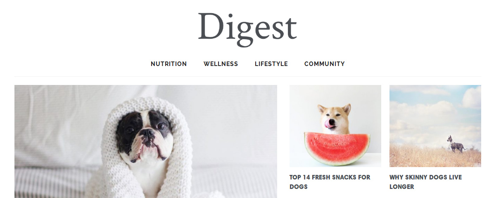

#  Foodog-SMGD

##  Authors - Contributing - Participation

**Dependency Management** [BeCode Charleroi](https://www.becode.org/) 

Developers:

GitHub -> [Sarah](https://github.com/sarahklewiec), [Morgan](https://github.com/MignotMorgan), [Geoffrey](https://github.com/geocani/), [David](https://github.com/david-thewissen)

Trello -> [Foodog-SMGD](https://trello.com/)

## Built With

\* \[**Atom**\](http://www.atome.com/) - Software used

\* \[**Visual Studio**\](http://www.visual.com/) - Software used

\* \[**Trello**\](https://trello.com/) - The web framework used

\* \[**WordPress**\](http://www.wordpress.com) - The web framework used

## Getting Started

*Team of four;*

### request

-Réaliser un blog pour un client. Ce client possède déjà une charte graphique et voudrais un blog qu'il pourrait facilement mettre à jour lui meme.

-Le blog sera composé d'une page d'acceuil, de quatres catégories et une single page pour les articles et les resultats des recherches.

### Consignes

### Instructions

1. Le site devra répondre à un minimum de 60% aux [lighthouse](https://developers.google.com/web/tools/lighthouse/) test dans toutes les catégories.
2. Le site devra être responsif, une maquette pour le desktop est déjà faite mais vous devez concevoir vous même une maquette pour la partie mobile. 
2. Le site devra répondre aux normes [w3c](https://validator.w3.org/).
3. Utilisez la structure MVC pour organiser vos fichiers.
4. La charte graphique pour la version desktop devra être scrupuleusement respectée. 
5. Utiliser Github au maximum. Tout le monde doit l'utiliser.
6. L'apport de travail doit être équitable entre les 4 équipiers. Départagez-vous les tâches équitablement. Utilisez un toutil comme Trello pour vous organiser. 
7. Utilisez les tags, certains articles devront apartenir à plusieurs catégories. 
7. Le système de pagination doit fonctionner.
7. La single page doit avoir un menu hamburger.
8. Intégrez-y un moteur de recherche. Pour la recheche, une fenêtre modale devra apparaître lorsqu'on l'on cliquera sur la loupe. 
9. Installez des plugins comme Yoast SEO pour le référencement.
10. **PAS DE BUG**, tout doit fonctionner. 

### Bonus 
1. Réalisez un score de 80% au lighthouse test.
2. Intégrez les Api's d'instagram et facebook.
3. Rajoutez des animations pour rendre le site plus vivant.
4. Intégrez un vrai module "post le plus populaire" dans le footer

### Deadline 
Mercredi **11/04/2018 à 9h00**.

### Prerequisites

Firefox;

Google chrome;

Safari;

### Installing

Just click on www.site.com.

## Staff's comment

##### Sarah: com .........................
##### Morgan : com ........................
##### Geoffrey: com ...............................
##### David: ............................

